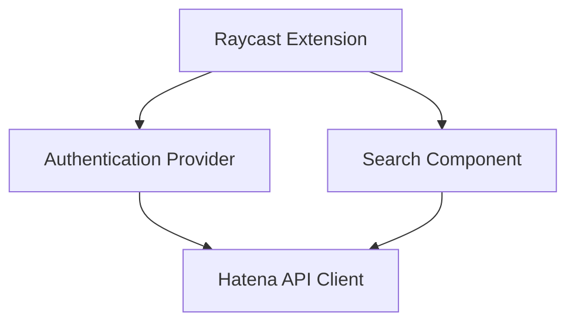

# システムパターン

## アーキテクチャ

## コンポーネント構成

1. 認証関連
   - `src/providers/authentication.tsx`: 認証状態の管理
   - `src/hooks/auth.ts`: 認証関連のカスタムフック

2. 検索機能
   - `src/search-bookmark.tsx`: メインの検索インターフェース
   - `src/hooks/search.ts`: 検索関連のカスタムフック

3. API通信
   - `src/lib/hatena.ts`: はてなブックマークAPIクライアント

## 設計パターン

1. カスタムフックパターン
   - 認証ロジックの分離
   - 検索ロジックの分離

2. プロバイダーパターン
   - 認証状態の共有

3. レイヤー分離
   - プレゼンテーション層: `.tsx`ファイル
   - ロジック層: `hooks/`ディレクトリ
   - API通信層: `lib/`ディレクトリ
